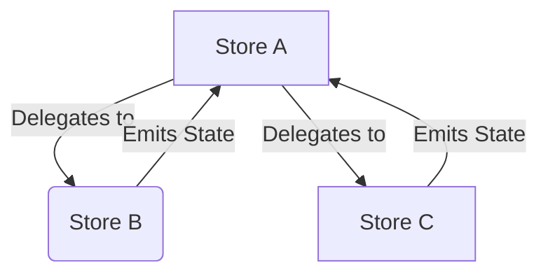

# Composing Stores

Stores can be nested in each other, and delegate some of their responsibilities to other Stores.

Accomplishing that is simple and done in 2 steps:

1. Optionally, the **parent** store `A` should manage lifecycle of its **child** `B`.
   It's as simple as launching child `B` in `PipelineContext` of the parent `A` (e.g. `init` plugin)
2. The **principal** store `A` is going to delegate some of its responsibilities to the **delegate** `B`.

The stores A and B switch roles based on the direction of the flow of control.



## Child Stores

Often, your child stores will have a lifecycle that is the same (or shorter) than the parent store.

FlowMVI provides a DSL to launch child stores:

```kotlin
class ParentContainer(
    child2: Store<ChildState, ChildIntent, ChildAction> // may have been started externally
) : Container<State, Intent, Action> {

    val child1 = store(ChildState.Loading) { /*...*/ }

    override val store = store(State.Loading) {

        this hasChild child1
        // or:
        installChild(child2, force = false, blocking = true)
    }
}
```

- The code above starts `child1` and `child2` using `PipelineContext` of parent `store`.
    - It means that as soon as `store` starts, children also start (asynchronously), and when `store` stops, it stops
      all its children.
- `hasChild` is a nice DSL for `installChild` plugin and its overloads.
- If you want to wait until all children start **before** the parent starts, set `blocking` to true.
    - While usually not needed, can save you some synchronization of side-effects and plugins at the cost of
      parent startup time.
- `force` is a parameter that defines whether you want to attempt starting the store always or only if it isn't
  already started. `force` is equal to `debuggable` by default to not crash your release app builds.
    - Example: If `force` is `true` and `child2` is already started when `store` starts, the plugin will throw.

## Delegating to Stores

Now let's look at the opposite - **principal** Store may want to shift some of its work onto the **delegate**.

This is very useful for composing the logic of handling state and splitting responsibilities between stores.

For example, to delegate State, the principal store will likely define its state as derived from other states:

```kotlin
sealed interface FeedState : MVIState { /* ... */ } // delegate
sealed interface AccountState : MVIState { /* ... */ }

data class HomeState(
    val feed: FeedState,
    val account: AccountState,
) : MVIState
```

Then in our principal container, we can create a special delegate object:

```kotlin
class ParentContainer() : Container<HomeState, HomeIntent, HomeAction> {

    private val feedStore = store(FeedState.Loading) { /*...*/ }
    private val accountStore = store(AccountState.Loading) { /* ... */ }

    override val store = store(State.Loading) {
        // [1]
        val feedState by delegate(feedStore) { feedAction ->
            // handle Actions from the delegate
        }

        // [2].
        this hasChild accountStore
        val accountState by delegate(accountStore, start = false)

        // use delegated states
        whileSubscribed {
            combine(feedState, accountState) { feed, account ->
                updateState { HomeState(feed, account) }
            }.consume()
        }
    }
}
```

You can see at \[1\] that our `feedState` is a state derived from delegating to `feedStore`.

The function `delegate()` assigns the target store as **a child** of the surrounding store, and hooks into the parent
lifecycle to update the state and handle actions when (by default) the principal store has subscriptions.

In essence, it subscribes to the **delegate** (`feedStore`) when the `store` has other subscribers (UI etc.)
and updates `feedState` flow with values from `feedStore.state`.
It's roughly equivalent to calling:

```kotlin
val feedState = MutableStateFlow(feedStore.state)

this hasChild feedStore

whileSubscribed {
    feedStore.subscribe { state ->
        feedState.value = state
    }
}
```

:::warning[Important detail]

You can see above that the `feedState` is **not** a direct mirror of the state of the `feedStore` -
it's only a projection. It can have **stale values** because it is **not updated** until the
principal store **has subscribers**.

:::

The behavior above is customizable, but is the default to conserve resources and ensure
the logic in delegates matches their expectations about when subscriptions happen.

Based on `mode` parameter, you can choose between:

- `WhileSubscribed` - the default outlined above.
- `Immediate` - the state will be a direct projection of the delegate's state, and the delegate will be subscribed to
  as soon as the principal store starts

Additionally, the delegate is automatically assigned a **child** status and started.
If you don't want that, pass `start = false` when installing the delegate ( like in \[2\] )

### Actions from Delegates

An important caveat to discuss is how side effects are handled. Yes, principal store can subscribe to actions of
delegates, but that isn't really necessary. You can still subscribe to delegate
stores as usual where you would normally do (UI etc).

If you want to add special logic from principal to an action in a child, you need to ensure `ActionShareBehavior` (ASB)
of children works properly with this new requirement. With `Distribute` ASB, the actions are **split** evenly between
subscribers, which principal store _is one of_. In this case, either use `Distribute`, but handle **all** actions
from children in principal (do not split the logic), or use `Share` and manually ensure no actions are sent when
subscribers are not present. More details on this limitation are in the ASB docs.

### Plugin vs Delegate

With two ways to split logic, how do you choose now whether you should make a store or a plugin?

Here's a table to help you decide:

| Consideration                      | Prefer Plugins                                   | Prefer Child Stores                                                 |
|------------------------------------|--------------------------------------------------|---------------------------------------------------------------------|
| **State Complexity**               | Small to medium, tightly coupled                 | High complexity or loosely coupled, can be split into parts         |
| **Intent Processing**              | Act on the same set of intents in different ways | Intents modify distinct pieces of state and send subsets of Actions |
| **Subscriber Timing & Data Needs** | Mostly same between all of subscribers           | Subscribers need the store state at differing times                 |
| **Component Lifecycles**           | Same lifecycle as the parent                     | Can sometimes differ                                                |
| **Performance**                    | When performance is critical                     | When the overhead of async processing per child store is acceptable |

In more detail:

- Prefer plugins when you want to act on mostly **the same set** of intents in different ways.
  If you want to split intent handling logic into pieces (with their own side effects and states), stores may be a
  better fit.
- If performance is of critical importance, prefer plugins. They are lightweight, in contrast,
  child stores introduce a layer of coroutines and async processing for **each** new child store.
- If your **state has grown** increasingly complex, with many intents mutating parts of that state that can mostly be
  isolated, prefer child stores. You may have different blocks on a page that load progressively, or a settings drawer
  on several pages that you may want to isolate from your main feature code.
- If you have differing lifecycles for some components of your logic, stores + composing via DI may be a good option.
- If your subscribers (e.g. UI) appear at different times and need different pieces of the state (e.g. progressive
  content loading blocks), child stores allow you to subscribe to each one separately from the parent.
