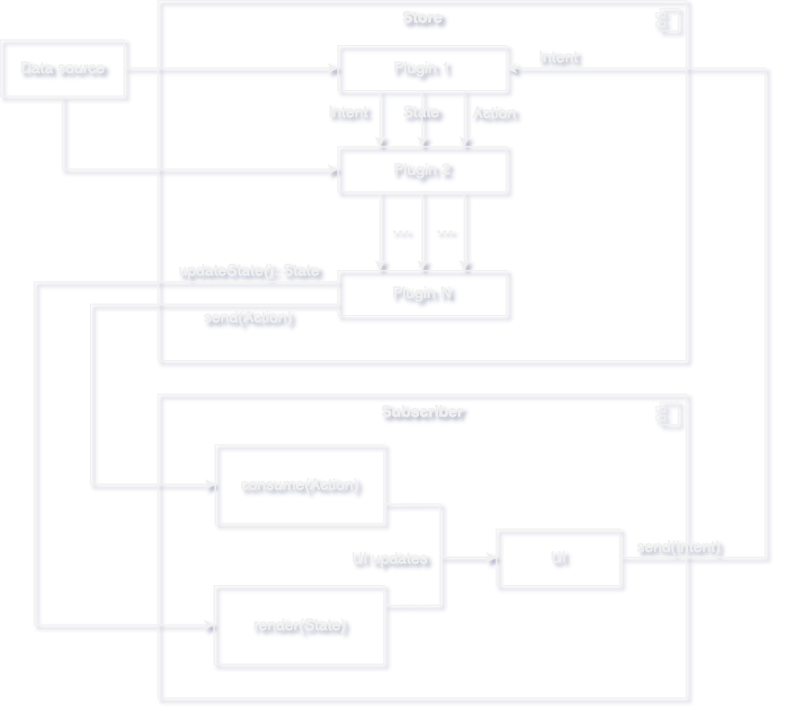

# Get Started with FlowMVI

Here's how the library works at a glance:



## Step 1: Add Dependencies


### Version catalogs

```toml
[versions]
flowmvi = "< Badge above 👆🏻 >"

[dependencies]
flowmvi-core = { module = "pro.respawn.flowmvi:core", version.ref = "flowmvi" } # multiplatform
flowmvi-android = { module = "pro.respawn.flowmvi:android", version.ref = "flowmvi" } # common android
flowmvi-view = { module = "pro.respawn.flowmvi:android-view", version.ref = "flowmvi" } # view-based android
flowmvi-compose = { module = "pro.respawn.flowmvi:android-compose", version.ref = "flowmvi" }  # androidx.compose
```

### Kotlin DSL

```kotlin
dependencies {
    val flowmvi = "< Badge above 👆🏻 >"
    commonMainImplementation("pro.respawn.flowmvi:core:$flowmvi")
    commonTestImplementation("pro.respawn.flowmvi:test:$flowmvi")

    androidMainImplementation("pro.respawn.flowmvi:android:$flowmvi")
    androidMainImplementation("pro.respawn.flowmvi:android-view:$flowmvi")
    androidMainImplementation("pro.respawn.flowmvi:android-compose:$flowmvi")
}
```

## Step 2: Choose your style

FlowMVI supports both MVI (strict model-driven logic) and the MVVM+ (functional, lambda-driven logic) styles.
It's preferable to choose one style and use it throughout your project.
Each style has its own pros and cons, so choosing can be hard.
So please consider the following comparison:

### MVI style:

| Pros 👍                                                                                              | Cons 👎                                                                                                                         |
|------------------------------------------------------------------------------------------------------|---------------------------------------------------------------------------------------------------------------------------------|
| Greater separation of concerns as intent handling logic is strictly contained in the store's scope   | Boilerplatish: some intents will need to be duplicated for multiple screens, resulting in some amount of copy-paste             |
| Verbose and readable - easily understand which intent does what judging by the contract              | Hard to navigate in the IDE. You have to jump twice: first to the declaration, and then to usage, to see the code of the intent |
| Intents can be decomposed into sealed families, subclassed,  delegated, have properties or functions | Class explosion - class for every event may result in 50+ model classes per screen easily                                       |
| Intents can be resent inside the store - by sending an intent while handling another intent          | Sealed classes work worse for some platforms, for example, in Swift, Enums are not used and names are mangled                   |

### MVVM+ style:

| Pros 👍                                                                                                 | Cons 👎                                                                         |
|:--------------------------------------------------------------------------------------------------------|:--------------------------------------------------------------------------------|
| Elegant declaration - open a lambda block and write your logic there. Store's code remains clean        | Store's context is accessible outside of the store, leading to scope creep      |
| Easily navigate to and see what intent does in one click                                                | Lambdas are less performant than regular intents, especially when using Compose |
| Easier to support on other platforms if handled correctly (not exposing store's logic in platform code) | Some plugins will become less useful, such as logging/time travel/analytics     |
| Get rid of all Intent classes entirely, avoid class explosion                                           | Intents cannot be composed, delegated, reused and organized into families       |

If you decide to use MVVM+ style, consider using `ImmutableStore` interface that won't let external code send 
intents. This will prevent leaking the context of the store to subscribers.

## Step 3: Describe your Contract

<details>
<summary>Click for general advice on how to define a contract if you're a newbie</summary>

Describing the contract first makes building the logic easier because you have everything you need at the
start. To define your contract, ask yourself the following:

1. What can be shown at what times? Can the page be empty? Can it be loading? Can errors happen? -
   this will define your state family.
2. What elements can be shown on this screen, for each state? - this will be your state properties.
3. What can the user do on this screen? What can happen in the system? - these will be your Intents.
4. In response to given intents, what one-time events may happen? - these are Actions.

* The `MVIState` is what should be displayed or used by the UI layer. Whenever the state changes,
  update **all** of your UI with the current properties of the state.
    * Do **not** make your state mutable. Because FlowMVI uses `StateFlow`s under the hood, your state changes
      **won't be reflected** if you mutate your state using `var`s or
      by using mutable properties such as `MutableList`s.
      Use `copy()` of the data classes to mutate your state instead. Even if you use `List`s as the value type,
      for example, make sure those are **new** lists and not just `MutableList`s that were upcasted.
    * It's okay to copy the state often, modern devices can handle a few garbage collections.
* The `MVIIntent` is an action that the user or the subscriber takes, for example, clicks, system broadcasts and dialog
  button presses.
* The `MVIAction` is a one-off event that should happen in the UI or that the subscriber should handle.
    * Examples include snackbars, popup messages, sounds and so on.
    * Do not confuse States with Actions! Actions are **one-off, "fire and forget" events**.
    * Actions are **sent and received sequentially**.
    * Actions are sent from Store to the UI. Intents are sent in the other direction.
    * Actions are not strictly guaranteed to be received by the subscriber, so do not use them for crucial elements of
      the logic.

</details>

```kotlin
// Must be comparable and immutable. Automatically marked as stable in Compose
sealed interface CounterState : MVIState {
    data object Loading : CounterState
    data class Error(e: Exception) : CounterState
    data class DisplayingCounter(
        val counter: Int,
    ) : CounterState
}

// MVI Style Intents
sealed interface CounterIntent : MVIIntent {
    data object ClickedNext : CounterIntent

    @JvmInline
    value class ChangedCounter(val value: Int) : CounterIntent

    data class GrantedPermission(val granted: Boolean, val permission: String) : CounterIntent
}

// MVVM+ Style Intents
typealias CounterIntent = LambdaIntent<CounterState, CounterAction>

// Optional - can be disabled by using Nothing as a type
sealed interface CounterAction : MVIAction {
    data class ShowMessage(val message: String) : CounterAction
}
```

## Step 4: Define your store

Here's a full list of things that can be done when configuring the store:

```kotlin
val store = store<CounterState, CounterIntent, CounterAction>(Loading) { // set initial state

    // Settings this to true enables additional store validations and debug logging.
    // the store will check your subscription events, launches/stops, and plugins for validity
    var debuggable = false

    // Set the future name of the store. Needed for debug/logging/comparing stores
    var name: String? = null

    // Declare that intents must be processed in parallel.
    // Intents may still be dropped according to the onOverflow param.
    var parallelIntents = false

    // A coroutine context override for the store.
    // This context will be merged with the one the store was launched with (e.g. viewModelScope).
    // All store operations will be launched in that context by default
    var coroutineContext: CoroutineContext = EmptyCoroutineContext

    // Define how the store handles and sends actions.
    // Choose one of the following: Share, Distribute, Restrict, Disable
    var actionShareBehavior = ActionShareBehavior.Distribute()

    // Designate behavior for when the store's intent queue overflows.
    var onOverflow = BufferOverflow.DROP_OLDEST

    // Designate the maximum capacity of store's intent queue
    // This should be either a positive value, or one of:
    // UNLIMITED, CONFLATED, RENDEZVOUS, BUFFERED
    var intentCapacity = Channel.UNLIMITED

    // Install a prebuilt plugin. The order of plugins matters!
    // Plugins will preserve the order of installation and will proceed according to this order.
    // Installation of the same plugin multiple times is not allowed.
    fun install(plugin: StorePlugin<S, I, A>)

    // Create and install a new StorePlugin on the fly.
    fun install(block: StorePluginBuilder<S, I, A>.() -> Unit)
}
```

Some interesting properties of the store:

* Store can be launched, stopped, and relaunched again as many times as you want.
  Use `close()`, or cancel the job to stop the store.
* Store's subscribers will **not** wait until the store is launched when they subscribe to the store.
  Such subscribers will not receive state updates or actions. Don't forget to launch the store.
* Stores are created eagerly usually, but the store *can* be lazy. There is `lazyStore()` for that.

## Step 5: Install plugins

FlowMVI is built entirely based on plugins!
**Everything** in FlowMVI 2.0 is a plugin. This includes handling errors and even **reducing intents**.

For every store, you'll likely want to install a few plugins.
Prebuilt plugins come with a nice dsl when building a store. Here's the list of prebuilt plugins:

* **Reduce Plugin** - process incoming intents. Install with `reduce { }`.
* **Init Plugin** - do something when store is launched. Install with `init { }`.
* **Recover Plugin** - handle exceptions, works for both plugins and jobs. Install with `recover { }`.
* **While Subscribed Plugin** - run jobs when the Nth subscriber of a store appears. Install
  with `whileSubscribed { }`.
* **Logging Plugin** - log events to a log stream of the target platform.
* **Saved State Plugin** - Save state somewhere else when it changes, and restore when the store starts. Android has
  `parcelizeState` and `serializeState` plugins based on this one. Install with `saveState(get = {}, set = {})`.
* **Job Manager Plugin** - keep track of long-running tasks, cancel and schedule them. Install with `manageJobs()`.
* **Await Subscribers Plugin** - let the store wait for a specified number of subscribers to appear before starting its
  work. Install with `awaitSubscribers()`.
* **Undo/Redo Plugin** - undo and redo any action happening in the store. Install with `undoRedo()`.
* **Disallow Restart Plugin** - disallow restarting store if you do not plan to reuse it.
  Install with `disallowRestart`.
* **Cache Plugin** - cache values in store's scope lazily and with the ability to suspend, binding them to the store's
  lifecycle. Install with `val value by cache { } `
* **Parent Store Plugin** - attach to another store and follow the subscription lifecycle. Install
  with `parentStore(otherStore) { state ->  } `
* **Literally any plugin** - just call `install { }` and use the plugin's scope to hook up to store events.

Consult the javadocs of the plugins to learn how to use them.

!> The order of plugins matters! Changing the order of plugins may completely change how your store works.
Plugins can replace, veto, consume or otherwise change anything in the store.
They can close the store or swallow exceptions!

Consider the following:

```kotlin
val broken = store(Loading) {
    reduce {

    }
    // ❌ - logging plugin will not log any intents
    // because they have been consumed by the reduce plugin
    install(consoleLoggingPlugin())
}

val working = store(Loading) {
    install(consoleLoggingPlugin())

    reduce {
        // ✅ - logging plugin will get the intent before reduce() is run, and it does not consume the intent
    }
}
```

That example was simple, but this rule can manifest in other, not so obvious ways. Consider the following:

```kotlin
val broken = store(Loading) {

    serializeState() // ‼️ restores state on start

    init {
        updateState {
            Loading // 🤦‍ and the state is immediately overwritten
        }
    }

    // this happened because serializeState() uses onStart() under the hood, and init does too.
    // Init is run after serializeState because it was installed later.
}
// or
val broken = store(Loading) {

    install(customUndocumentedPlugin()) // ‼️ you don't know what this plugin does

    reduce {
        // ❌ intents are not reduced because the plugin consumed them
    }
    init {
        updateState {
            // ❌ states are not changed because the plugin veto'd the change
        }
        action(MyAction) // ❌ actions are replaced with something else
    }
}
```
So make sure to consider how your plugins affect the store's logic when using and writing them.

The discussion above warrants another note.

!> Because plugins are optional, you can do weird things with them. The library has validations in place to make sure
you handle intents, but it's possible to create a store like this:
`val store = store(Loading) { }`.
This is a store that does **literally nothing**. If you forget to install a plugin, it will never be run.

### Step 6: Create, inject and provide dependencies

You'll likely want to provide some dependencies for the store to use and to create additional functions instead of just
putting all code into the store's builder.

The best way to do this is to create a class that acts as a simple wrapper for your store. By convention, it can
usually be called `Container`[^1]. Feel free to not use the provided interface, its only purpose is to act as a marker.

```kotlin
private typealias Ctx = PipelineContext<CounterState, CounterIntent, CounterAction>

class CounterContainer(
    private val repo: CounterRepository,
) : Container<CounterState, CounterIntent, CounterAction> {

    override val store = store(Loading) {
        whileSubscribed {
            repo.timer
                .onEach { produceState(it) } 
                .consume()
        }
    }

    // example custom function
    private fun Ctx.produceState(timer: Int) = updateState { DisplayingCounter(timer) }
}
```

Next steps:

* Learn how to create custom [plugins](plugins.md)
* Learn how to use DI and [Android-specific features](android.md)
* [Read an article](https://medium.com/@Nek.12/success-story-how-flowmvi-has-changed-the-fate-of-our-project-3c1226890d67)
  about how our team has used the library to improve performance and stability of our app, with practical examples.
* Explore
  the [sample app](https://github.com/respawn-app/FlowMVI/tree/master/app/src/main/kotlin/pro/respawn/flowmvi/sample)

--- 

[^1]: Although container is a slightly different concept usually, we don't have this kind of separation and we use the
name "store" for our business logic unit already, so the name was kinda "free" to define what it will mean for
FlowMVI
