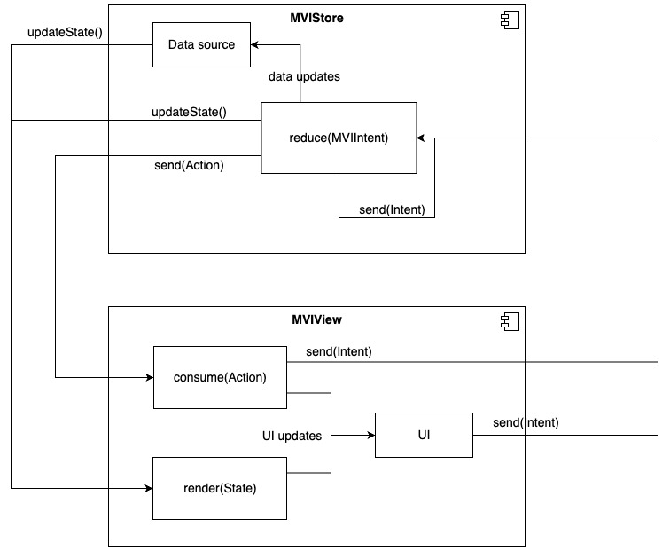

Here's how the library works at a glance:



## Step 1: Add Dependencies


```toml
[versions]
flowmvi = "< Badge above 👆🏻 >"

[dependencies]
flowmvi-core = { module = "pro.respawn.flowmvi:core", version.ref = "flowmvi" } # multiplatform
flowmvi-android = { module = "pro.respawn.flowmvi:android", version.ref = "flowmvi" } # common android
flowmvi-view = { module = "pro.respawn.flowmvi:android-view", version.ref = "flowmvi" } # view-based android
flowmvi-compose = { module = "pro.respawn.flowmvi:android-compose", version.ref = "flowmvi" }  # androidx.compose
```

## Step 2: Choose your style

FlowMVI supports both MVI (strict model-driven logic) and the MVVM+ (functional, lambda-driven logic) styles.
It's preferable to choose one style and use it throughout your project.

So please consider the following comparison:

### MVI-style:

| Upsides 👍                                                                                         | Downsides 👎                                                                                                                      |
|----------------------------------------------------------------------------------------------------|-----------------------------------------------------------------------------------------------------------------------------------|
| Greater separation of concerns as intent handling logic is strictly contained in the store's scope | Boilerplatish: some intents will need to be duplicated for multiple screens, resulting in some amount of copy-paste               |
| Verbose and readable - easily understand which intent does what judging by the contract            | Hard to navigate in the IDE. You have to jump twice: first to the declaration, and then to usage, to see what a given intent does |
| Intents can be decomposed into sealed families, subclassed, and have properties or functions       | More and possibly bigger object allocation due to each intent creating a class instance + all params                              |
| Intent handling can be delegated away to other stores or classes                                   | Class explosion - class for every event may result in 50+ model classes per screen easily                                         |
| Intents can be resent inside the store - by sending an intent while handling another intent        | Sealed classes work worse for some platforms than functions, for example in Swift, Enums are not used and names are mangled       |

### MVVM+ -style:

| Upsides 👍                                                                                              | Downsides 👎                                                                      |
|:--------------------------------------------------------------------------------------------------------|:----------------------------------------------------------------------------------|
| Elegant declaration - open a lambda block and write your logic there. Store's code remains clean        | Store's context is accessible outside of the store, leading to scope creep        |
| Easier to support on other platforms if handled correctly (not exposing store's logic in platform code) | Some plugins will become less useful, such as logging/time travel/analytics       |
| Get rid of all Intent classes entirely                                                                  | Intents cannot be resent, composed, delegated, reused and organized into families |
| Easily navigate to and see what intent does in one click                                                | Lambdas are less performant than regular intents                                  |

## Step 3: Describe your Contract

Describing the contract first makes building the logic easier because you have everything you need at the
start.

<details>
<summary>**General advice on how to define a contract**</summary>

To define your contract, ask yourself the following:

1. What can be shown at what times? Can the page be empty? Can it be loading? - this will define your state family
2. What elements can be shown on this screen? - this will be your states' properties.
3. What can the user do on this screen? What can happen in the system? - these will be your Intents
4. In response to given intents, what one-time events may happen? - these are Actions

* The `MVIState` is what should be displayed or used by the UI layer. Whenever the state changes,
  update **all** of your UI with the current properties of the state.
    * Do **not** make your state mutable. Because FlowMVI uses `StateFlow`s under the hood, your state changes
      //*won't be reflected** if you mutate your state using `var`s or
      by using mutable properties such as `MutableList`s.
      Use `copy()` of the data classes to mutate your state instead. Even if you use `List`s as the value type,
      for example, make sure those are **new** lists and not just `MutableList`s that were upcasted.
    * It's okay to copy the state very often, modern devices can handle a few garbage collections.
* The `MVIIntent` is an action that the user or the subscriber takes, for example clicks, permission grants and dialog
  button presses.
* The `MVIAction` is a one-off event that should happen in the UI or that the subscriber should handle.
    * Examples include Snackbars, Popup messages, Sounds and so on.
    * Do not confuse States with Actions! Actions are **one-off, "fire and forget" events**.
    * Actions are **sent sequentially**.
    * Actions are sent from Store to the UI. Intents are sent in the other direction.

</details>

```kotlin
// Must be comparable and immutable
internal sealed interface ScreenState : MVIState {
    data object Loading : ScreenState
    data class Error(e: Exception) : ScreenState
    data class DisplayingCounter(
        val counter: Int,
    ) : ScreenState
}

// Optional - can use LambdaIntents for MVVM+-style
internal sealed interface ScreenIntent : MVIIntent {
    data object ClickedNext : ScreenIntent

    @JvmInline
    value class ChangedCounter(val value: Int) : ScreenIntent

    data class GrantedPermission(val granted: Boolean, val permission: String) : ScreenIntent
}

// Optional - can disable by using Nothing as a type
internal sealed interface ScreenAction : MVIAction {
    data class ShowMessage(val message: String) : ScreenAction
}
```

## Step 4: Define your store

Here's a full list of things that can be done when configuring the store:

```kotlin

val store = store<ScreenState, ScreenIntent, ScreenAction>(Loading) { // set initial state

    // Settings this to true enables additional store validations and debug logging.
    // the store will check your subscription events, launches/stops, and plugins for validity
    var debuggable = false

    // Set the future name of the store. Needed for debug/logging/comparing stores
    var name: String? = null

    // Declare that intents must be processed in parallel.
    // All guarantees on the order of intents will be lost.
    // Intents may still be dropped according to the onOverflow param.
    var parallelIntents = false

    // Define how the store handles and sends actions.
    // Choose one of the following: Share, Distribute, Restrict, Disable
    var actionShareBehavior = ActionShareBehavior.Distribute()

    // Designate behavior for when the store's intent queue overflows.
    var onOverflow = BufferOverflow.DROP_OLDEST

    // Designate the maximum capacity of store's intent queue
    // This should be either a positive value, or one of:
    // UNLIMITED, CONFLATED, RENDEZVOUS, BUFFERED
    var intentCapacity = Channel.UNLIMITED

    // Install a prebuilt plugin. The order of plugins matters!
    // Plugins will preserve the order of installation and will proceed according to this order.
    // Installation of the same plugin multiple times is **not allowed**.
    fun install(plugin: StorePlugin<S, I, A>)

    // Create and install a new StorePlugin. The order of plugins matters!
    fun install(block: StorePluginBuilder<S, I, A>.() -> Unit)
}
```

Some interesting properties of the store:

* Store can be launched, stopped, and relaunched again as many times as you want. Use close(), or cancel the job to stop
  the store.
* Store's subscribers will wait until the store is launched when they subscribe to the store. Don't forget to launch the
  store.
* Store's plugins are created eagerly, but the store itself can be lazy. There are delegate functions for that.

## Step 5: Install plugins

FlowMVI is built entirely based on plugins!
**Everything** in FlowMVI 2.0 is a plugin. This includes handling errors and even **reducing intents**.

For every store, you'll likely want to install a few plugins.
Prebuilt plugins come with a nice dsl when building a store. Here's the list of prebuilt plugins:

* **Reduce Plugin** - process incoming intents. Install with `reduce { /* ... */ }`
* **Init Plugin** - do something when store is launched. Install with `init { /* ... */ }`
* **Recover Plugin** - handle exceptions happens, works for both plugins and jobs. Install with `recover { /* ... */ }`
* **While Subscribed Plugin** - run jobs when the first subscriber of a store appears. Install
  with `whileSubscribed { }`.
* **LoggingPlugin** (console/android/platform) - log events to a log stream for your chosen platform.
* **SavedStatePlugin** - Save state somewhere else when it changes, and restore when the store starts. Android has
  parcelizeState and serializeState plugins build based on this one. Install with `saveState(get = {}, set = {})`.
* **Literally any plugin** - just call `install { }` and use the plugin's scope to hook up to store events.

> [!ATTENTION]
> The order of plugins matters! Changing the order of plugins may completely change how your store works.
> Plugins can replace, veto, consume or otherwise change anything in the store.
> They can cancel subscriptions, close the store or swallow exceptions.

Consider the following:

```kotlin
val broken = store(Loading) {
    reduce {

    }
    // ❌ - logging plugin will not log any intents
    // because they have been consumed by the reduce plugin
    install(consoleLoggingPlugin())
}

val working = store(Loading) {
    install(consoleLoggingPlugin())

    reduce {
        // ✅ - logging plugin will get the intent before reduce() is run, and it does not consume the intent
    }
}
```

That example was simple, but this rule can manifest in other, not so obvious ways. Consider the following:

```kotlin
val broken = store(Loading) {

    parcelizeState() // ⚠️ restores state from the saved state handle 

    init {
        updateState {
            Loading // 🤦‍ and the state is immediately overwritten
        }
    }

    // this happened because savedState() uses onStart() under the hood, and init does too.
    // Init is run after savedState because it was installed later.
}
// or
val broken = store(Loading) {

    install(customUndocumentedPlugin()) // ⚠️ you don't know what this plugin does

    reduce {
        // ❌ intents are not reduced because the plugin consumed them
    }
    init {
        updateState {
            // ❌ states are not changed because the plugin veto'd the change
        }
        send(MyAction) // ❌ actions are replaced with MyAnotherAction
    }
}
```

So make sure to consider how your plugins affect the store's logic when using and writing them.

The discussion above warrants another note.

> [!NOTE]
> Because plugins are optional, you can do weird things with them. The library has validations in place to make sure
> you handle intents, but it's possible to create a store like this:
> `val store = store(Loading) { }`
> This is a store that does **literally nothing**. If you forget to install the reduce plugin, your intents won't be
> acted upon.
