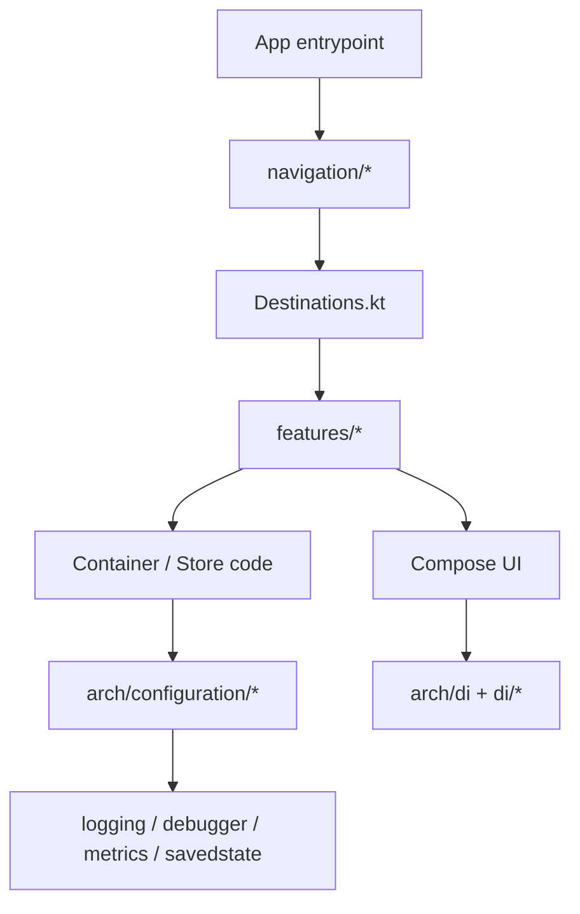

# FlowMVI Sample App

This module is the “showcase” app used to demonstrate FlowMVI in a real-ish codebase (navigation, DI, multiple targets).
If you’re here to see what FlowMVI code looks like in practice, most of what you want is in `src/commonMain`.

Also available as a hosted demo: https://opensource.respawn.pro/FlowMVI/sample/

## Where to start (code)

- App shell + navigation: [AppContent.kt](src/commonMain/kotlin/pro/respawn/flowmvi/sample/navigation/AppContent.kt)
- Destination routing (what screen is shown for what feature): [Destinations.kt](src/commonMain/kotlin/pro/respawn/flowmvi/sample/navigation/destination/Destinations.kt)
- “Feature menu” (entry screen): [HomeScreen.kt](src/commonMain/kotlin/pro/respawn/flowmvi/sample/features/home/HomeScreen.kt)
- Feature DI registrations (what’s available / scoped): [FeatureModule.kt](src/commonMain/kotlin/pro/respawn/flowmvi/sample/features/FeatureModule.kt)

## Package map

```
pro.respawn.flowmvi.sample
├─ arch/                 # app-level FlowMVI configuration + DI helpers
│  ├─ configuration/     # StoreBuilder config, state saving, metrics, remote debugger
│  └─ di/                # Koin helpers + Decompose destination scoping
├─ di/                   # startKoin(), common + platform DI modules
├─ features/             # “how to do X” examples (each is a small, isolated feature)
├─ navigation/           # Decompose-based navigation shell + destinations
├─ platform/             # expect/actuals (files, feature launching, etc.)
├─ ui/                   # theme + reusable UI widgets (not FlowMVI-specific)
└─ util/                 # small shared utils (serialization, platform flags, etc.)
```



## “I want an example of …”

### Minimal store + reducer

- [SimpleContainer.kt](src/commonMain/kotlin/pro/respawn/flowmvi/sample/features/simple/SimpleContainer.kt)
- [SimpleScreen.kt](src/commonMain/kotlin/pro/respawn/flowmvi/sample/features/simple/SimpleScreen.kt)

### LCE (loading/content/error) + repository boundary

- [LCEContainer.kt](src/commonMain/kotlin/pro/respawn/flowmvi/sample/features/lce/LCEContainer.kt)
- [LCERepository.kt](src/commonMain/kotlin/pro/respawn/flowmvi/sample/features/lce/LCERepository.kt)
- [LCEScreen.kt](src/commonMain/kotlin/pro/respawn/flowmvi/sample/features/lce/LCEScreen.kt)

### State saving / restoration (savedstate module)

- App-wide saver wiring + plugin install: [DefaultConfigurationFactory.kt](src/commonMain/kotlin/pro/respawn/flowmvi/sample/arch/configuration/DefaultConfigurationFactory.kt)
- Feature example: [SavedStateContainer.kt](src/commonMain/kotlin/pro/respawn/flowmvi/sample/features/savedstate/SavedStateContainer.kt)

### Store configuration patterns (recommended “setup” to copy)

The sample centralizes StoreBuilder config (name, overflow, parallelism, optional plugins) behind a DI-provided factory:

- [ConfigurationFactory.kt](src/commonMain/kotlin/pro/respawn/flowmvi/sample/arch/configuration/ConfigurationFactory.kt)
- [DefaultConfigurationFactory.kt](src/commonMain/kotlin/pro/respawn/flowmvi/sample/arch/configuration/DefaultConfigurationFactory.kt)
- StoreBuilder helper overloads: [ConfigurationExt.kt](src/commonMain/kotlin/pro/respawn/flowmvi/sample/arch/configuration/ConfigurationExt.kt)

### Logging plugin

- [LoggingContainer.kt](src/commonMain/kotlin/pro/respawn/flowmvi/sample/features/logging/LoggingContainer.kt)
- Sample UI: [LoggingScreen.kt](src/commonMain/kotlin/pro/respawn/flowmvi/sample/features/logging/LoggingScreen.kt)

### Undo/Redo

- [UndoRedoContainer.kt](src/commonMain/kotlin/pro/respawn/flowmvi/sample/features/undoredo/UndoRedoContainer.kt)
- [UndoRedoScreen.kt](src/commonMain/kotlin/pro/respawn/flowmvi/sample/features/undoredo/UndoRedoScreen.kt)

### Metrics (metrics module) + exporting

- Setup + periodic reporting: [DefaultConfigurationFactory.kt](src/commonMain/kotlin/pro/respawn/flowmvi/sample/arch/configuration/DefaultConfigurationFactory.kt)
- Sink wiring (debugger sink on some targets): [RemoteDebugger.kt](src/commonMain/kotlin/pro/respawn/flowmvi/sample/arch/configuration/RemoteDebugger.kt)

### Remote debugging (debugger-plugin module)

- StoreBuilder hook point: [RemoteDebugger.kt](src/commonMain/kotlin/pro/respawn/flowmvi/sample/arch/configuration/RemoteDebugger.kt)
- Platform implementations:
  - Desktop: [RemoteDebugger.desktop.kt](src/desktopMain/kotlin/pro/respawn/flowmvi/sample/arch/configuration/RemoteDebugger.desktop.kt)
  - Web: [RemoteDebugger.web.kt](src/webMain/kotlin/pro/respawn/flowmvi/sample/arch/configuration/RemoteDebugger.web.kt)
  - Native: [RemoteDebugger.native.kt](src/nativeMain/kotlin/pro/respawn/flowmvi/sample/arch/configuration/RemoteDebugger.native.kt)

### Decompose integration (navigation + state keeper)

- Root component + stack: [RootComponent.kt](src/commonMain/kotlin/pro/respawn/flowmvi/sample/navigation/component/RootComponent.kt)
- Destinations + child components: [DestinationComponent.kt](src/commonMain/kotlin/pro/respawn/flowmvi/sample/navigation/component/DestinationComponent.kt)
- Example feature: [DecomposeScreen.kt](src/commonMain/kotlin/pro/respawn/flowmvi/sample/features/decompose/DecomposeScreen.kt)

### Android XML Views integration (flowmvi-android module)

- Feature store: [XmlActivityContainer.kt](src/commonMain/kotlin/pro/respawn/flowmvi/sample/features/xmlactivity/XmlActivityContainer.kt)
- View-based Activity showing `ContainerViewModel` + `subscribe(...)`: [XmlActivity.kt](src/androidMain/kotlin/pro/respawn/flowmvi/sample/ui/screens/XmlActivity.kt)
